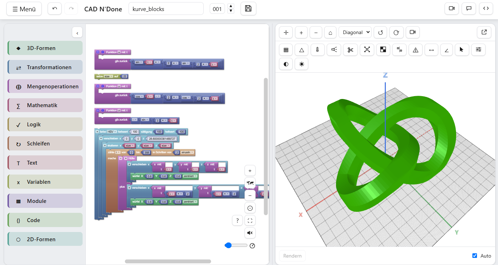
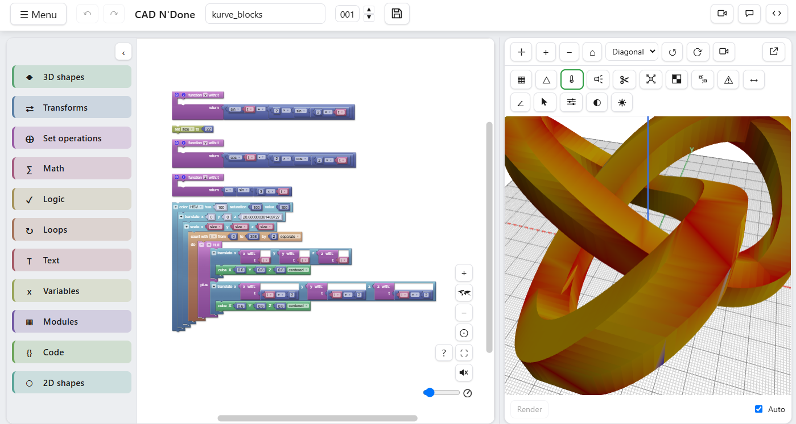
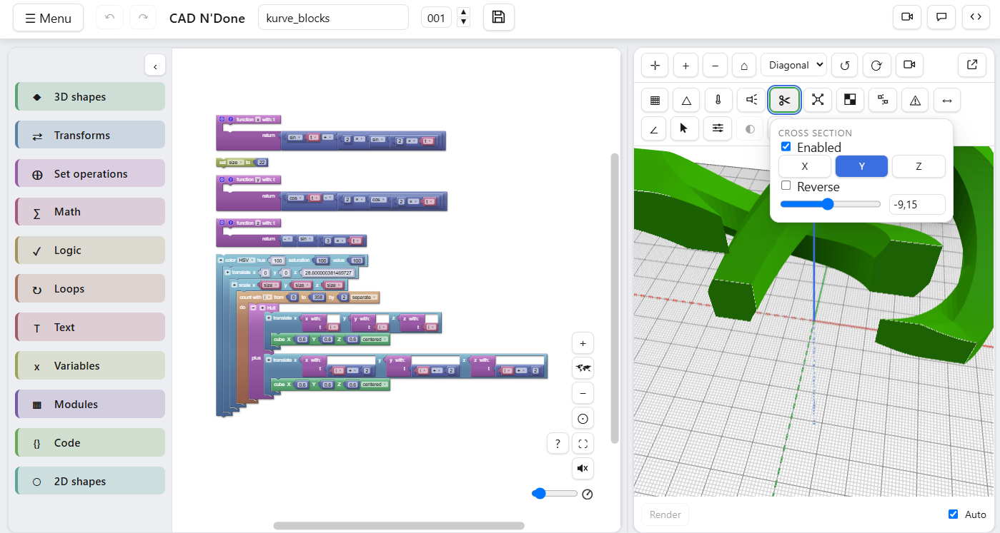
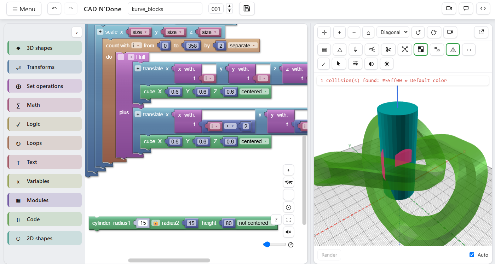
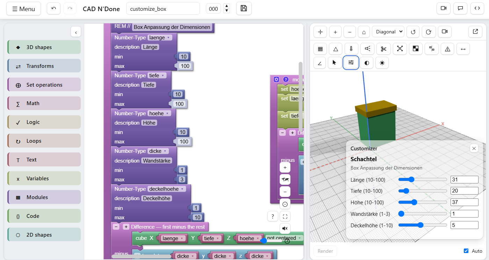
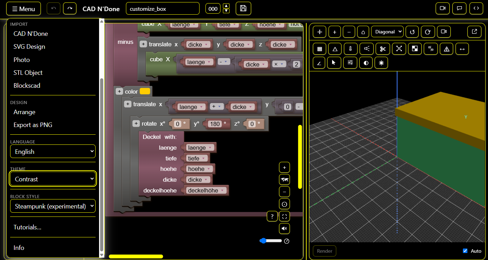

# CAD N'Done

🇬🇧 [English](README.md) · 🇩🇪 Deutsch

Blockly-basierter Editor für OpenSCAD-Modelle mit Live-Codegenerierung,
Rendering im Web Worker (openscad-wasm) und interaktiver 3D-Vorschau (Three.js).

<p align="center">
  
</p>

## Screenshots

| | |
|---|---|
|  <br>Wandstärken-Heatmap |  <br>Querschnittsansicht |
|  <br>Kollisionserkennung |  <br>Customizer mit Schiebereglern |
|  <br>Dark Theme & mehrsprachiges UI | |

## Status

Phasen 0–5 des Master-Prompts sind umgesetzt: Setup, Grundgerüst, Blockly-Editor
mit eigenen OpenSCAD-Blöcken, Codegenerierung, Render-Pipeline im Web Worker und
3D-Viewer inkl. Export. Details zu Phase 0: `docs/phase0-report.md`.

## Setup

```bash
npm install
npm run dev
```

Startet den Vite-Dev-Server: `/` zeigt die Landingpage (index.html), der Editor
selbst liegt unter `/startcadndone.html` - dort Blöcke zusammenstecken
(links/Mitte), Code-Vorschau optional einblenden, 3D-Vorschau rechts (rendert
automatisch oder manuell).

`phase0.html` bleibt als Referenz erreichbar: vier isolierte Machbarkeitstests
(Blockly-Workspace, openscad-wasm → STL, Three.js-Szene, web-tree-sitter).

## Weitere Befehle

```bash
npm run build     # Typecheck (App + Worker) + Produktionsbuild (index.html + startcadndone.html + phase0.html)
npm run preview   # Produktionsbuild lokal ansehen
npm run lint      # ESLint
npm run format    # Prettier (schreibt Aenderungen)
```

## Architektur

Jede Schicht kommuniziert nur über definierte Schnittstellen (siehe `src/types/`):

```
src/
├── editor/    Blockly-Setup, eigene Blockdefinitionen, Zoom-/Minimap-Cluster
├── codegen/   Blocks -> OpenSCAD-Generator
├── render/    Web Worker, openscad-wasm-Anbindung
├── viewer/    Three.js-Szene, Loader, Export (STL/GLB/Screenshot)
├── parser/    OpenSCAD -> AST (tree-sitter) -> Blocks (Phase 6, aktuell zurueckgestellt)
├── types/     gemeinsame TypeScript-Interfaces zwischen den Schichten
├── i18n/      Mehrsprachigkeit (Deutsch/Englisch)
├── ui/        App-Layout, Panels, Themes
├── phase0/    Machbarkeitstests aus Phase 0 (siehe docs/phase0-report.md)
└── main.ts    App-Einstiegspunkt
```

Details zum Proxy-Setup, den geloesten Bundling-Problemen und dem offenen
tree-sitter-Grammatik-Blocker: `docs/phase0-report.md`.
